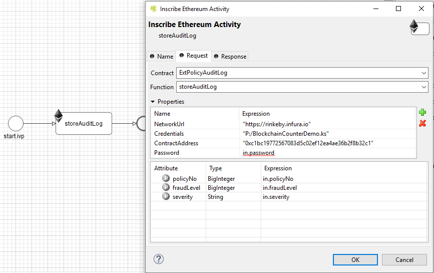
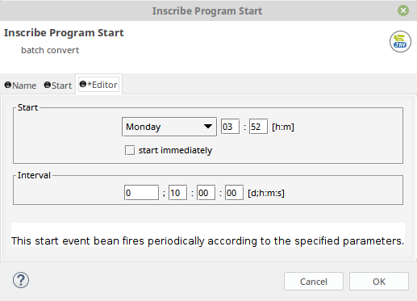

# BPM Beans
A collection of free Axon Ivy process extensions.

## [ETHEREUM](blockchain-beans/README.md)
An Ethereum Blockchain bean to do calls against Ethereum contracts, with input and output mapping.

## [TIMED START](timedStartEvent-beans/README.md)
A timed start event bean with weekday, time and interval parameters.

